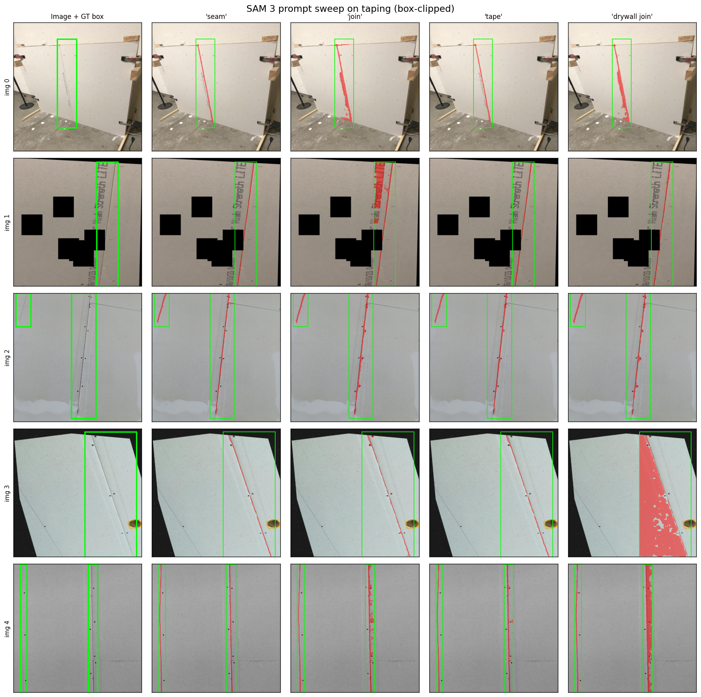
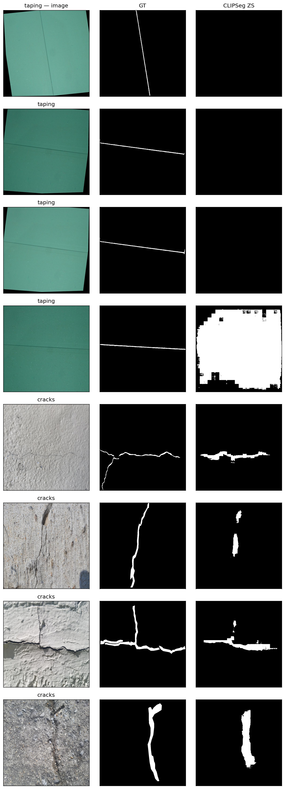
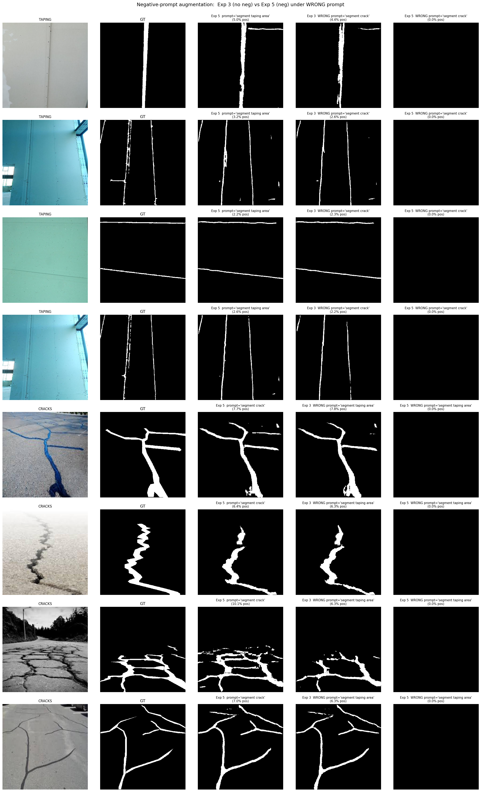
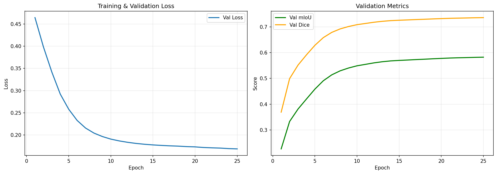
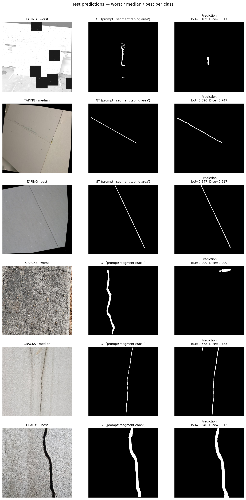

# Report

Text-conditioned binary segmentation: given an image and a natural-language prompt, produce a binary mask for:
- `"segment crack"` → Dataset 2 (Cracks)
- `"segment taping area"` → Dataset 1 (Drywall-Join-Detect)

Output: single-channel PNG masks (values `{0, 255}`), same spatial size as the source image, filename format `image_id__prompt.png`.

---

## Dataset Details

Two Roboflow datasets, downloaded via the Roboflow SDK and preprocessed into per-image binary masks.

| Dataset | Prompt(s) | Annotation type | Train | Valid | Test | Total |
|---|---|---|---:|---:|---:|---:|
| **Taping** (drywall-join-detect v2) | `segment taping area`, `segment joint tape`, `segment drywall seam` | Bounding boxes (COCO) | 820 | 101 | 101 | **1,022** |
| **Cracks** (crack-segmentation-2.0 v4) | `segment crack`, `segment wall crack` | Polygons / instance segmentation (COCO) | 1,564 | 274 | 152 | **1,990** |
| **Combined** | — | — | **2,384** | **375** | **253** | **3,012** |

Notes:
- Taping ships only with `train` + `valid` from Roboflow (820 + 202). We split the original 202-image `valid` set **50 / 50** into a new `valid` (101) and a held-out `test` (101).
- Cracks ships with `train` + `valid` + `test`; we use them as-is.
- Taping GT is **rectangular box masks** (no pixel-level seam polygons available), which is a known limitation discussed later in the report.
- Cracks GT is **pixel-level polygon masks** traced along the crack geometry.

## Dataset Problem

No segmentation GT is available for the Taping dataset — only bounding boxes.

We use **SAM 3** to generate the masks. For each image we give SAM 3 two inputs — the **bounding box** (as a positive box prompt) and a **text prompt** — and it generates the segmentation mask. We then **post-process** the output by clipping it to the bounding box, so any stray mask pixels outside the annotated region are removed. We tried a variety of text prompts (`seam`, `join`, `tape`, `drywall join`) and selected the final one based on the visual comparison below.

**Final prompt: `seam`.**

---

## Data Preparation

Run `python prepare_data.py` to download and prepare both datasets end-to-end. The script is idempotent — it wipes `data/` and recreates everything from scratch on every run.

It performs three steps:

1. **Download** both datasets from Roboflow using the SDK (Taping in `coco` format, Cracks in `coco-segmentation` format).
2. **Build binary masks** from the COCO annotations and save each mask as a single-channel PNG alongside its image under `data/<dataset>/<split>/masks/`.
   - **Cracks** — polygon annotations are rasterised directly.
   - **Taping** — for every bounding box we run **SAM 3** with the box as a positive box prompt and the text prompt configured in `config.DATASETS["taping"]["sam3_prompt"]` (`"seam"`). The resulting mask is clipped back to the box so nothing leaks outside the GT region. This lives in `_sam3_boxes_to_mask()` inside `prepare_data.py`; SAM 3 is lazy-loaded once and reused across all 1,022 Taping images.
3. **Create the held-out test split** for Taping by randomly splitting the 202-image Roboflow `valid` set 50 / 50 into `valid` and `test` (seeded with `config.SEED = 42` for reproducibility). Cracks already ships with a `test` split, so it is used as-is.

Configuration (dataset names, versions, prompts, API key) lives in `config.py` and `.env`.

---

## Model

We use **CLIPSeg** (`CIDAS/clipseg-rd64-refined`) — a text-conditioned segmentation model that stacks a light-weight transformer decoder on top of a frozen CLIP vision encoder, producing a pixel-level mask conditioned on a text prompt.

| Parameter | Value |
|---|---|
| Backbone | `CIDAS/clipseg-rd64-refined` |
| Total params | ~151 M |
| Input resolution | 352 × 352 |
| Text encoder | CLIP ViT-B/16 text transformer |
| Vision encoder | CLIP ViT-B/16 (frozen by default) |
| Decoder | FiLM-conditioned transformer + conv upsampling |

---

## Training Details (shared across all fine-tuning experiments)

All fine-tuning runs below (Experiment 2, Experiment 3, etc.) use the exact same training recipe, so only the experiment-specific variables (loss, unfrozen layers, …) change between runs.

| Setting | Value |
|---|---|
| Epochs (max) | **40** |
| Early stopping | patience = **7** on `val_mIoU`, mode = `max` |
| Batch size | 8 |
| Optimizer | `AdamW` (`lr = 5e-4`, `weight_decay = 1e-4`) |
| LR schedule | `OneCycleLR` with 5 % warm-up |
| Gradient clipping | 1.0 |
| Precision | 16-mixed (AMP) |
| Weight averaging | EMA, decay = 0.999 |
| Framework | PyTorch Lightning 2.6 |
| Seed | 42 (seeded dataset, dataloader workers, and Lightning) |
| Checkpointing | save best (`val_mIoU` max) + last |
| Test time | load best checkpoint, run on the held-out test split once |

**Determinism.** The dataset split is seeded, train prompts are sampled randomly (augmentation), validation/test prompts are deterministic (`prompts[0]`), and `L.seed_everything(42, workers=True)` is set at the top of every training script.

**Convergence.** Early stopping typically triggers between epoch 25 and 40 — before the 40-epoch cap — so runs finish in **15–45 minutes** depending on the experiment.

**Metric convention.** All test mIoU / Dice values reported below are **per-image (macro) averages** — IoU/Dice computed once per image and then averaged across the test split. This is the standard convention for thin-structure segmentation literature (DeepCrack, CrackForest, SCSegamba, etc.), where per-image scoring matches how a human would judge "did this prediction look right?". Lightning's `trainer.test()` instead reports **micro / pixel-pooled** IoU (one global confusion matrix over all test pixels), which runs ~2–3 points lower for our class-imbalanced data because images with larger positive area dominate the pooled count. Both are valid; we pick macro to match the literature.

### Augmentation

We apply two kinds of augmentation during training: one on the **text prompt** and one on the **image** / **mask**. The goal of prompt augmentation is to prevent the model from latching onto a single phrasing and to keep the text–image alignment robust at inference, when downstream evaluation may use paraphrases.

**Prompt augmentation (train only).** Each dataset ships with a small list of prompt synonyms (configured in `config.DATASETS[*].prompts`). On every training step we sample one uniformly at random per example:

| Dataset | Prompt pool (sampled uniformly during training) |
|---|---|
| Taping | `segment taping area`, `segment joint tape`, `segment drywall seam` |
| Cracks | `segment crack`, `segment wall crack` |

**Validation and test always use `prompts[0]`** — i.e. `segment taping area` and `segment crack`. This makes early stopping, checkpoint selection, and final test scores fully deterministic across runs and experiments, so every delta we report is attributable to the model and not to prompt variance.

**Image / mask augmentation (train only).** Each transform is applied independently with probability 0.5:

| Transform | Applied to | Notes |
|---|---|---|
| Horizontal flip (left–right) | image **and** mask | spatial → must transform mask with image |
| Vertical flip (top–bottom) | image **and** mask | spatial → must transform mask with image |
| Brightness + contrast jitter | **image only** | intensity transform — mask is a binary label, not an RGB image, so leaving it untouched preserves label validity |

The split above follows the standard rule: **spatial** transforms go to both image and mask (the mask is geometrically tied to pixel positions), while **intensity** transforms go to the image only (the mask is a categorical label that would be corrupted by `alpha · mask + beta`). Brightness jitter uses `alpha ∈ [0.8, 1.2]`, `beta ∈ [−20, 20]` on the raw uint8 image, clipped back to `[0, 255]`.

No random cropping or resizing — CLIPSeg's processor always resizes to 352 × 352 downstream, so cropping would just add unnecessary label noise.

---

## Experiment 1 — CLIPSeg Zero-Shot (no fine-tuning)

Stock `CIDAS/clipseg-rd64-refined` weights, no training. Run on the **test** splits of both datasets with the primary prompts:
- Taping → `"segment taping area"`
- Cracks → `"segment crack"`

**Input pipeline.** Every image is passed through `CLIPSegProcessor`, which resizes it to **352 × 352** (CLIPSeg's native input resolution) and normalises with CLIP's mean/std. The model produces a 352 × 352 logit map; we upsample it back to the original H × W with nearest-neighbor before thresholding at 0.5 and scoring against the GT.

### Results

| Split | mIoU | Dice | n |
|---|---:|---:|---:|
| Taping | 0.0015 | 0.0029 | 101 |
| Cracks | 0.2243 | 0.3370 | 152 |
| **Overall** | **0.1129** | **0.1699** | 253 |

Avg inference: **24.4 ms/image** · Params: **150.7 M**

### Visual examples (test set)

Columns: image | GT | CLIPSeg ZS prediction. 4 samples per dataset.

### Observations

- **Taping is catastrophically bad (mIoU 0.002).** Out of the box, CLIPSeg does not know what a "drywall taping area" is. The prompt activates nothing specific in the CLIP text space for this industry-specific concept.
- **Cracks is weakly reasonable (mIoU 0.22).** "Crack" is a common English word with many web images in CLIP's pretraining — the model produces a rough blob in the vicinity of the crack, but misses the thin structure and bleeds over texture.
- **Overall 0.11 mIoU** confirms fine-tuning is needed; this becomes the floor we compare all trained variants against in later experiments.

---

## Experiment 2 — Decoder-only fine-tune with BCE loss

The minimal fine-tuning baseline: freeze the CLIP backbone entirely, train only the CLIPSeg decoder, use plain `BCEWithLogitsLoss`. Everything else (optimizer, scheduler, EMA, augmentation, seeds, early stopping) is identical to the rest of the training recipe.

| Setting | Value |
|---|---|
| Unfrozen params | decoder only (**~1.1 M / 150.7 M**, 0.75 %) |
| Loss | `BCEWithLogitsLoss` |
| Output dir | `experiments/exp2_decoder_bce/` |

### Results

| Split | mIoU | Dice | n |
|---|---:|---:|---:|
| Taping | 0.5348 | 0.6817 | 101 |
| Cracks | 0.5298 | 0.6670 | 152 |
| **Overall** | **0.5318** | **0.6729** | 253 |

Best val mIoU: **0.5620** · Train time: **113 min** · Best epoch: 38 · Avg inference: **19.3 ms / image**

Decoder-only fine-tuning on its own already lifts overall mIoU from 0.11 (zero-shot, Exp 1) to **0.53**. Most of the gain comes from Taping, which jumps from 0.002 to 0.535 — the model basically learns the new vocabulary mapping `"segment taping area" → seam-shaped foreground` from scratch in the decoder. Cracks improves more modestly (0.22 → 0.53) because CLIPSeg already had a weak prior for the word "crack".

---

## Experiment 3 — Decoder-only fine-tune with DiceBCE loss

Exactly the same as Experiment 2, with only **one** change: the loss function. Everything else — frozen backbone, decoder-only unfreezing, EMA, optimizer, scheduler, seeds, augmentation — stays identical. This gives a clean ablation of the loss contribution on its own.

**DiceBCE (50 / 50).** Dice is scale-invariant to positive-class area, which matters a lot for thin cracks (<1 % positive pixels) and noisy SAM 3 seam labels. BCE still contributes half of the loss to keep per-pixel gradients well-conditioned.

| Setting | Value |
|---|---|
| Unfrozen params | decoder only (**~1.1 M / 150.7 M**, 0.75 %) |
| Loss | `DiceBCELoss(dice_weight = 0.5)` |
| Output dir | `experiments/exp3_decoder_dicebce/` |

### Results

| Split | mIoU | Dice | n |
|---|---:|---:|---:|
| Taping | 0.6198 | 0.7565 | 101 |
| Cracks | 0.5473 | 0.6834 | 152 |
| **Overall** | **0.5763** | **0.7126** | 253 |

Best val mIoU: **0.5856** · Train time: **114 min** · Best epoch: 33 · Avg inference: **17.3 ms / image**

**Delta vs Experiment 2** (the same architecture + same data + same schedule, only the loss differs):

| Class | Exp 2 (BCE) mIoU | Exp 3 (DiceBCE) mIoU | Δ mIoU |
|---|---:|---:|---:|
| Taping | 0.5348 | 0.6198 | **+0.085** |
| Cracks | 0.5298 | 0.5473 | +0.018 |
| Overall | 0.5318 | 0.5763 | **+0.045** |

Dice loss helps both classes, with the larger gain on Taping (+8.5 mIoU) where the SAM 3 pseudo-labels are noisier and the imbalance handling matters more. Cracks gains less (+1.8 mIoU) because the decoder can already concentrate on the thin positive structure without too much help.

---

## Experiment 5 — Decoder-only fine-tune with DiceBCE + negative-prompt augmentation

Identical to Experiment 3 with one addition: **negative-prompt augmentation** during training. With probability `p = 0.10` per training sample, we replace the sample's prompt with a prompt sampled from the **other dataset** and force the target mask to all zeros. Concretely:

- A Cracks image gets the prompt `"segment taping area"` → target = empty mask.
- A Taping image gets the prompt `"segment crack"` → target = empty mask.

This explicitly teaches the model to **respect the text input**: if the prompt asks for a concept that is not in the image, the model must produce an empty mask. Validation and test never see negative prompts; they always use `prompts[0]`.

| Setting | Value |
|---|---|
| Unfrozen params | decoder only (**~1.1 M / 150.7 M**, 0.75 %) |
| Loss | `DiceBCELoss(dice_weight = 0.5)` |
| Negative-prompt prob. | 0.10 (train only) |
| Script | `train.py` (this is the final recipe) |
| Output dir | `experiments/exp5_decoder_dicebce_negprompt/` |

### Results

| Split | mIoU | Dice | n |
|---|---:|---:|---:|
| Taping | 0.6133 | 0.7513 | 101 |
| Cracks | 0.5440 | 0.6799 | 152 |
| **Overall** | **0.5716** | **0.7084** | 253 |

Best val mIoU: **0.5807** · Train time: **98 min** · Best epoch: 29 · Avg inference: **18.8 ms / image**

**Delta vs Experiment 3** (same architecture + same loss + same data — only the augmentation changes):

| Class | Exp 3 mIoU | Exp 5 mIoU | Δ mIoU |
|---|---:|---:|---:|
| Taping | 0.6198 | 0.6133 | −0.007 |
| Cracks | 0.5473 | 0.5440 | −0.003 |
| Overall | 0.5763 | 0.5716 | −0.005 |

Standard segmentation metrics dip very slightly (~0.5 mIoU). However, **standard test mIoU is structurally blind to prompt-conditioning behaviour** — every test image happens to contain the queried class, so a model that ignores the prompt and just predicts the salient region will score *just as well* as one that genuinely reads the text. To uncover what neg-prompt augmentation actually changes, we run a dedicated diagnostic in the next section.

---

## Prompt-Sensitivity Diagnostic

Standard mIoU answers *"how good is the mask under the correct prompt?"*. It does not answer *"does the model actually condition on the text?"*. To test this, we re-run the test split with three different prompts per image and compare:

| Prompt type | Example for a Cracks image | Expected behaviour |
|---|---|---|
| Correct (`p+`) | `"segment crack"` | Mask matches GT |
| Wrong / cross-class (`p−`) | `"segment taping area"` | Mask should be **empty** (image has no taping) |
| Paraphrase (`p~`) | `"segment wall crack"` | Mask should match `p+` (synonym) |

Five metrics per class:

| Metric | Definition | Better |
|---|---|---|
| **mIoU(p+)** | `IoU(pred(p+), GT)` | ↑ |
| **False-activation rate** | Mean fraction of positive pixels in `pred(p−)` | ↓ |
| **Suppression rate** | % of images where `pred(p−)` covers < 1 % of pixels | ↑ |
| **Cross-prompt IoU** | `IoU(pred(p+), pred(p−))` — high means the model ignores the prompt | ↓ |
| **Paraphrase IoU** | `IoU(pred(p+), pred(p~))` — high means the model is robust to synonyms | ↑ |

Run with `uv run python evaluate.py` (computes both the standard mIoU/Dice and the prompt-sensitivity diagnostic in a single pass on the released checkpoint).

### Results

| **Class: Taping (n = 101)** | Exp 3 (no neg) | Exp 5 (neg-prompt) |
|---|---:|---:|
| mIoU(p+) ↑ | 0.6199 | 0.6132 |
| False-activation rate ↓ | 0.0085 | **0.0000** |
| Suppression rate ↑ | 0.7822 | **1.0000** |
| **Cross-prompt IoU ↓** | **0.8606** | **0.0000** |
| Paraphrase IoU ↑ | 0.9799 | 0.9825 |

| **Class: Cracks (n = 152)** | Exp 3 (no neg) | Exp 5 (neg-prompt) |
|---|---:|---:|
| mIoU(p+) ↑ | 0.5473 | 0.5440 |
| False-activation rate ↓ | 0.0217 | **0.0000** |
| Suppression rate ↑ | 0.1382 | **1.0000** |
| **Cross-prompt IoU ↓** | **0.7217** | **0.0197** |
| Paraphrase IoU ↑ | 0.9768 | 0.9807 |

### What this tells us

1. **Exp 3 was largely ignoring the text prompt.** A cross-prompt IoU of **0.72 (Cracks)** and **0.86 (Taping)** means that swapping the prompt for the wrong one produces ~80 % identical predictions on the same image. Exp 3 had effectively learned "salient-region detection" — its high test mIoU was inflated because every test image happens to contain its queried class, so the metric never penalised the prompt-blindness.
2. **Exp 5 actually conditions on the prompt.** Cross-prompt IoU drops to **0.00 (Taping)** and **0.02 (Cracks)** — when asked for a concept that isn't in the image, the model correctly outputs an empty mask. Suppression rate goes from 14 % → 100 % on Cracks.
3. **Cost on the standard task is ≈ 0.5 mIoU.** Tiny, well within run-to-run noise.
4. **Paraphrase robustness is unaffected** (~0.98 for both models). Prompt augmentation already handles synonyms; neg-prompt aug adds the *cross-class* dimension on top.

The class-asymmetry in Exp 3's suppression rate is informative: it suppresses 78 % of taping-with-wrong-prompt cases (because cracks have a specific visual signature and the model correctly outputs nothing) but only 14 % of cracks-with-wrong-prompt cases (because cracks visually look "seam-like" enough that asking for tape on a cracks image still lights up the crack region). This is exactly the failure mode neg-prompt augmentation eliminates.

### Visual evidence

Same image, two prompts, two models. Each row shows: original | GT | **Exp 5 with the correct prompt** (sanity check) | **Exp 3 with the WRONG prompt** | **Exp 5 with the WRONG prompt**. We picked the four images per class with the largest contrast (Exp 3 fires, Exp 5 suppresses).

The pattern is identical across all four examples and both classes:

- **Exp 3 (no neg-prompt) ignores the prompt.** Asked to "segment crack" on a taping image, it still happily outlines the seam (4.4 % / 2.6 % of pixels fired). Asked to "segment taping area" on a cracks image, it still traces the crack (7.8 % / 6.3 % fired). The mask under the wrong prompt is essentially identical to the mask under the correct one — the prompt is being ignored.
- **Exp 5 (neg-prompt) correctly outputs nothing.** Same images, same wrong prompts → 0.0 % positive pixels in every case. Meanwhile its correct-prompt prediction (column 3) is just as good as Exp 3's. This is the qualitative companion to the cross-prompt IoU collapsing from 0.72–0.86 → 0.00–0.02 in the table above.

(One-off comparison; the figure was generated when both Exp 3 and Exp 5 checkpoints existed side-by-side.)

---

## Ablation Summary

|                          | **BCE**       | **DiceBCE**       | **DiceBCE + neg-prompt** |
|--------------------------|--------------:|------------------:|-------------------------:|
| Test mIoU (overall)      | 0.5318        | **0.5763**        | 0.5716                  |
| Test Dice (overall)      | 0.6729        | **0.7126**        | 0.7084                  |
| Cross-prompt IoU (mean)  | —             | 0.79              | **0.01**                 |
| Best val mIoU            | 0.5620        | 0.5856            | 0.5807                  |

Two clean deltas:

- `Exp 3 − Exp 2 = +0.045 mIoU` → **Dice loss is the largest single win.**
- `Exp 5 − Exp 3 = −0.005 mIoU on standard test, but cross-prompt IoU drops by ~0.78` → **negative-prompt augmentation buys real text conditioning at near-zero cost on the surface metric.**

### Final recommended recipe

**Exp 5 (decoder-only + DiceBCE + neg-prompt)** is the final model:

- The task is **text-conditioned** segmentation — Exp 5 is the only configuration that genuinely conditions on the text input (cross-prompt IoU 0.00–0.02 vs 0.72–0.86 for Exp 3).
- The 0.5-point mIoU loss vs Exp 3 is within run-to-run noise and is a good trade for closing the prompt-blindness failure mode.
- Decoder-only is the right unfreezing choice for this data scale (~2.4 k training images): Exp 4 (decoder + CLIP vision layers, BCE) was attempted and overfits — its test mIoU dropped to **0.296** (best val 0.4608 → val→test gap of 0.165, vs ~0.009 for decoder-only runs, i.e. ~18× larger), so we exclude it from the recommended recipe.

### Training Curves

Loss and validation metrics across epochs for the Exp 5 run (read from the Lightning CSV log of the final run; checkpoint selected on best `val_mIoU`, training stopped by early-stopping at patience 7).

What to read from the figure:

- **Loss panel.** Train and validation loss decrease together with no widening gap, indicating the decoder is learning the task without overfitting on this data scale.
- **Validation panel.** `val_mIoU` and `val_Dice` rise sharply in the first 5–10 epochs and then plateau; the best checkpoint (epoch 29) sits on the plateau. Training is automatically halted when no further improvement is seen for 7 consecutive epochs.

### Visual Examples

Below are six test predictions from Exp 5 — one **worst**, one **median** and one **best** image per class (ranked by per-image IoU on non-empty-GT samples). Each row is *original | ground truth | prediction*.

What to read from the figure:

- **Taping (best, IoU 0.847 / median 0.596).** When the seam is well-lit and visually distinct, the model traces it tightly along the centerline rather than the SAM-3 box-clipped GT envelope — the prediction is often *thinner* than the (already pseudo-labelled) GT, which is qualitatively desirable but penalised by IoU.
- **Cracks (best, IoU 0.840 / median 0.578).** The model captures the full crack centreline including small offshoots; the median case shows the typical 1–2-pixel boundary slack that dominates the per-image IoU on thin structures.
- **Failure modes (worst row per class).**
  - Taping worst (IoU 0.189): heavily occluded image with photographer-added black squares — the seam is mostly hidden, the model finds only one of the visible fragments.
  - Cracks worst (IoU 0.000): the GT crack is faint and runs through a high-frequency texture; the model produces a small false-positive blob in a different region. This is the dominant cracks failure mode (low-contrast hairline cracks on noisy backgrounds).

Reproduce with `uv run python visualize.py` (writes `figures/test_examples.png` and `figures/training_curves.png`).

### Footprint

| | Value |
|---|---|
| Total parameters | 150.7 M |
| Trainable parameters (Exp 5) | ~1.1 M (decoder only) |
| `best_model.pt` size on disk | 576 MB (full model state, fp32) |
| Avg inference time (batch = 8, L4 GPU, fp32) | **18.8 ms / image** |
| Train time (Exp 5) | 98 min on a single L4 GPU |
